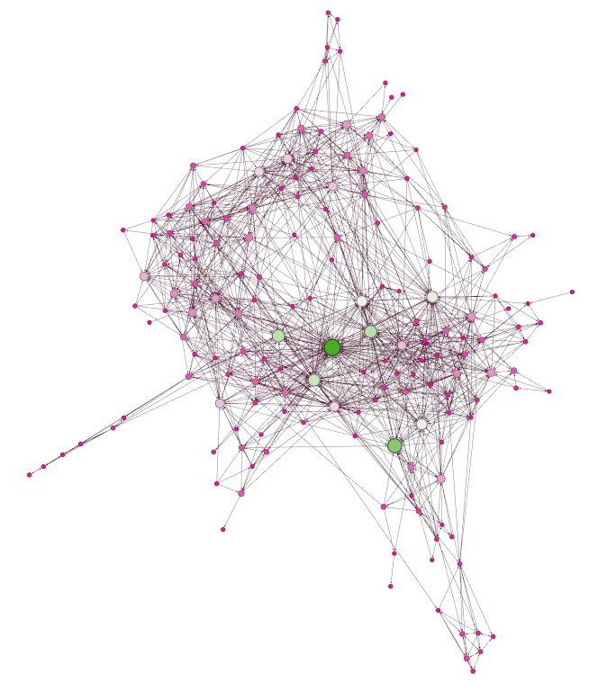
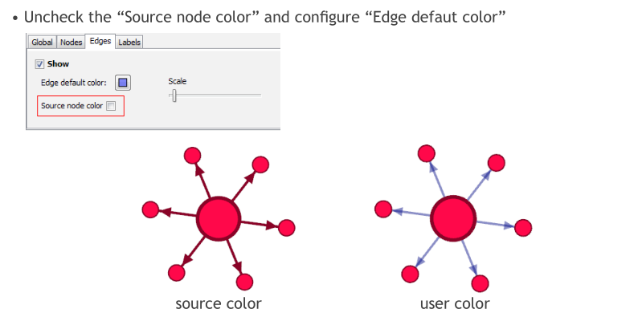

# 介绍
Gephi 是网络上流传很广的一款数据可视化方面的开源软件, 主要以制作网络图谱, 复杂系统图谱和层级关系图出名, 就是类似于制作下面这样的图(图片取自该软件的官网). 本文使用的是0.9.0版本的 Gephi.

# 制作步骤
## 导入数据
打开软件, 新建一个项目, 在"Data Laboratory"里用"Import Spreatsheet"导入节点(Nodes)和边(Edges)的数据, 我这里采用导入csv的格式.

对于节点来说, ID 和 Label 列是必须的, 现在还支持有 Timestamp 列, 说明还支持时间维的分析, 此处没有涉及, 我们在 Node 中还加入了 Role 列, 用来区分节点的类型, 一会在制图时对于不同的 Role 我们会用不同的颜色来表示. 

对于 Edges 来说, 标准的含有 Source, Target, Type, Id, Label, Timestamp, Weight 列, 我们此处画的是有向图, 所以 Type 列用的是"Directed", 其他列的含义从列名中可以看出.

## 生成图谱
如下图, 在 Overview 面板里可以看到刚才导入的数据所生成的点和变, 现在我们要开始设置图形的一些参数并计算生成合适的网络图谱.

对边上几块小面板做一个简单的介绍:

* Appearance: 控制点的颜色和大小, 边的颜色, 点和边的 Label 的字体颜色和大小;
* Layout: 选择不同的算法进行计算图形生成的样子, 几个主要的算法在后面细讲;
* Context: 一些统计信息的计算结果;
* Statistics: 可以很方便地计算一些网络图的统计量, 点击相应指标后面的"Run"键后就会计算出相应的结果;
* Filters: 将此处的要进行筛选的指标拖入下方区域就可以对图谱进行相应的筛选;

将点和边的大小颜色做好相应设置后, 我们就要选择算法来生成想要的图形了, 这一步是最核心的一步, 生成的图形的最终效果其实就是要让有联系的点靠近, 没有联系的点分开, 不同的算法生成的效果会不尽相同, 适用于不同的场景.

常用的主要是 Force Atlas, 这个算法适用于大多数的场景, 它的一些参数的意思如下:

* Autostab strength: 调高让点的移动更缓慢;
* Repulsion strength: 让点互相排斥的力度;
* Attraction strength: 有关连的点的互相吸引的力度;
* Gravity: 所有点向中心靠拢的力度;
* Adjust by Sizes: 把这个勾选上可以避免点的重叠(overlap);

ForceAtlas 2 是之前算法的升级版, 能处理更大量的数据, 降低算法复杂度, 用"scaling"参数来替代原来的"attraction"和"repulsion"两个指标.

选择 Force Atlas 计算好后, 生成大致如下的图形.

## 细节调整
图谱的形状可以通过尝试运行不同的算法直到让自己满意, 后续就是要一些细节, 包括点和边 Label 显示(颜色, 大小, 字体等等), 边的颜色还可以设置成和源点的颜色一致, 下面几个截图说到了会用到的几个按钮.

后续直接在菜单栏的"Export"里就可以导出自己想要的格式.

