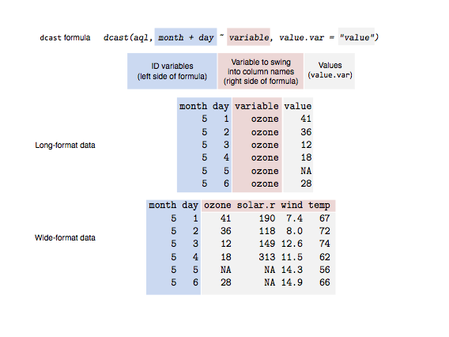

# 简介

reshape 和 reshape2 包是 Hadley Wickham 写的包, 主要在数据的宽格式(wide format)和长格式(long format)之间做转化使用.

# 宽格式和长格式

每个变量作为一个列存储就是宽格式, 如下

```
#   ozone   wind  temp
# 1 23.62 11.623 65.55
# 2 29.44 10.267 79.10
# 3 59.12  8.942 83.90
# 4 59.96  8.794 83.97
```

那么如下的就是长格式

```
#    variable  value
# 1     ozone 23.615
# 2     ozone 29.444
# 3     ozone 59.115
# 4     ozone 59.962
# 5      wind 11.623
# 6      wind 10.267
# 7      wind  8.942
# 8      wind  8.794
# 9      temp 65.548
# 10     temp 79.100
# 11     temp 83.903
# 12     temp 83.968
```

长格式就是有一个列来存储变量名, 一个列来存储变量值, 当然这样的结构不一定只有两个列, 比如上面的数据就还可有日期的列.

宽格式的数据和长格式数据在实际中都会有自己的用途, 在实际的数据分析中, 长格式的数据用得比较多, ggplot2 需要长格式的数据, plyr 也需要长格式的数据, 并且大多数的模型函数也需要长格式的数据, 但是做数据记录和展现的时候宽格式的数据是很方便的.

# reshape2 包

reshape2 包主要围绕两个函数, melt 和 cast 函数.

* melt 将宽格式数据转换为长格式数据;
* cast 将长格式数据转换为宽格式数据;

## 宽转长的 melt 函数

下面使用数据 airquality 来做演示, 为方便起见先将列名转换成小写列名.

```{r}
library(reshape2)
names(airquality) <- tolower(names(airquality))
head(airquality)
aql <- melt(airquality) # [a]ir [q]uality [l]ong format
head(aql)
tail(aql)
```

可以看到上面 melt 将日期也转换为变量名, 所以需要制定变量的 id 列, 如下

```{r}
aql <- melt(airquality, id.vars = c("month", "day"))
head(aql)
```

还可以指定长格式数据的变量列名

```{r}
aql <- melt(airquality, id.vars = c("month", "day"),
  variable.name = "climate_variable", 
  value.name = "climate_value")
head(aql)
```

## 长转宽的 cast 函数

在 reshape2 包里的 cast 函数有好几种, dcast 是处理类型为 data.frame 的数据, acast 则是对 vactor, matrix, array 格式的数据, 此处主要以 dcast 函数来做演示.

dcast 函数中使用一个公式 formula 来表示要组合的数据结构, 公式左边是 id 变量, 右边是度量变量所在的列名, 在下面的例子中, 剩下的最后一个列就自动转为变量值的列, 但是在一些其他的情形中需要通过 value.var 参数来明确指出变量值的列名.


```{r}
aql <- melt(airquality, id.vars = c("month", "day"))
aqw <- dcast(aql, month + day ~ variable)
head(aqw)
```

下面这张图很好地解释了 dcast 函数, 其中蓝色的部分的是 id 列, 红色的是变量, 灰色部分是变量值部分.



一个可能会引起"错误"的地方在于一个数据点的位置可能会有多个变量值, 比如如下我们去掉 day 这个变量

```{r}
dcast(aql, month ~ variable)
```

执行上面的命令可以看到有一个提示"Aggregation function missing: defaulting to length", 从上面的数据可以看出, 这样默认得到的是数出了月份的天数. 当做 cast 的时候一个数据位置上会有多个数据时需要制定数据的聚合方式, 如下例子用取均值的聚合.

```{r}
dcast(aql, month ~ variable, fun.aggregate = mean, 
  na.rm = TRUE)
```


参考:
1. [An Introduction to reshape2](http://seananderson.ca/2013/10/19/reshape.html)
