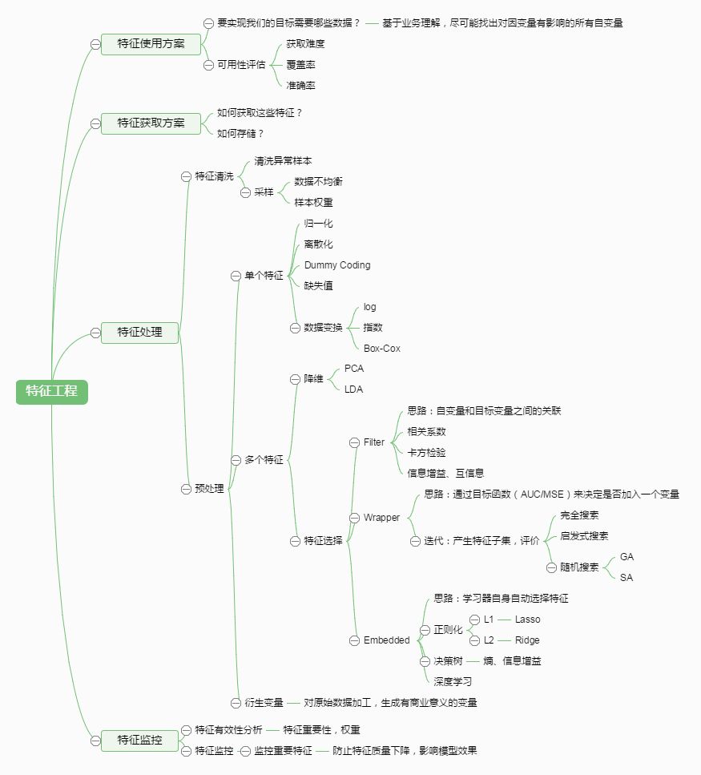
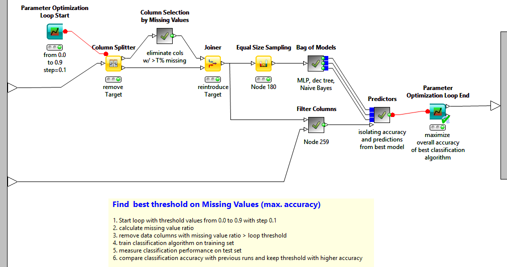
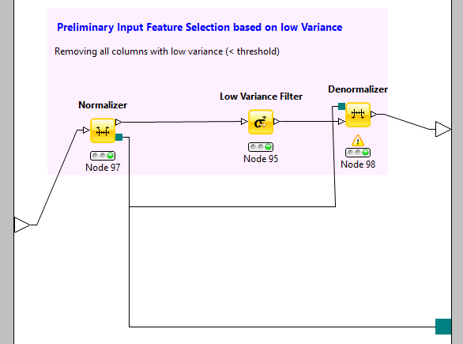
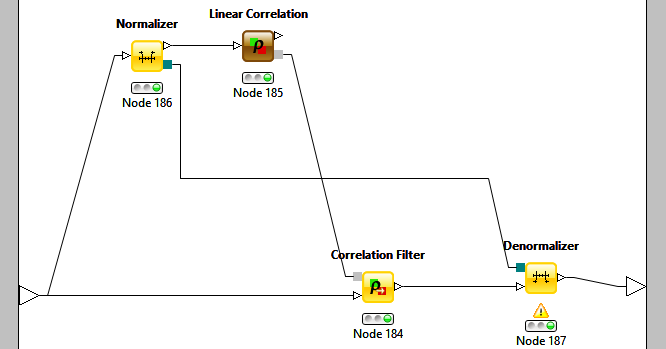
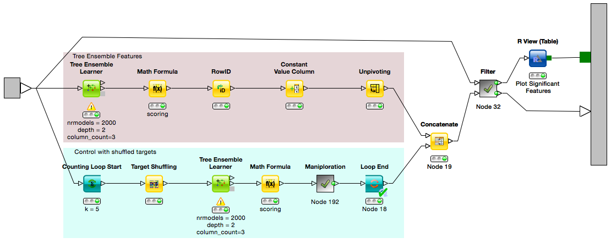
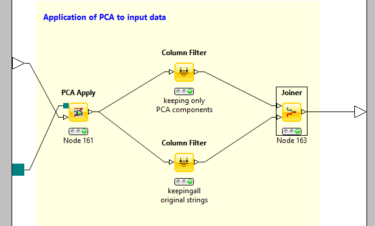
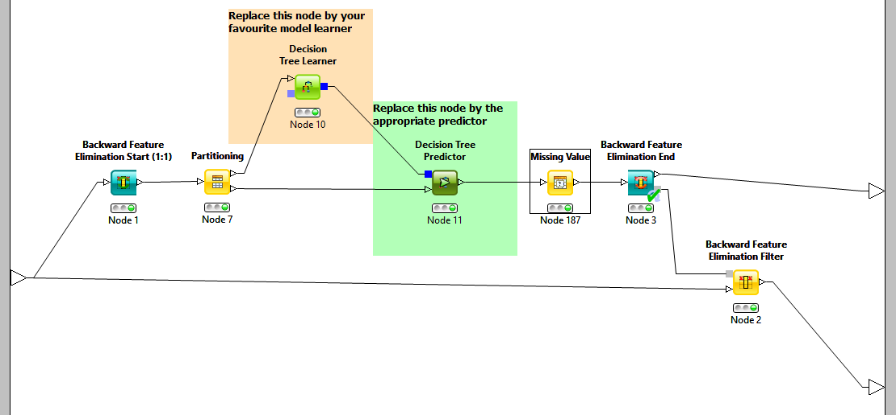
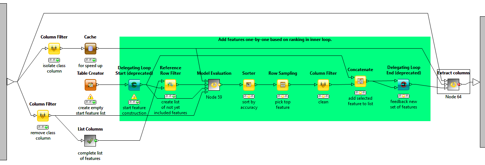
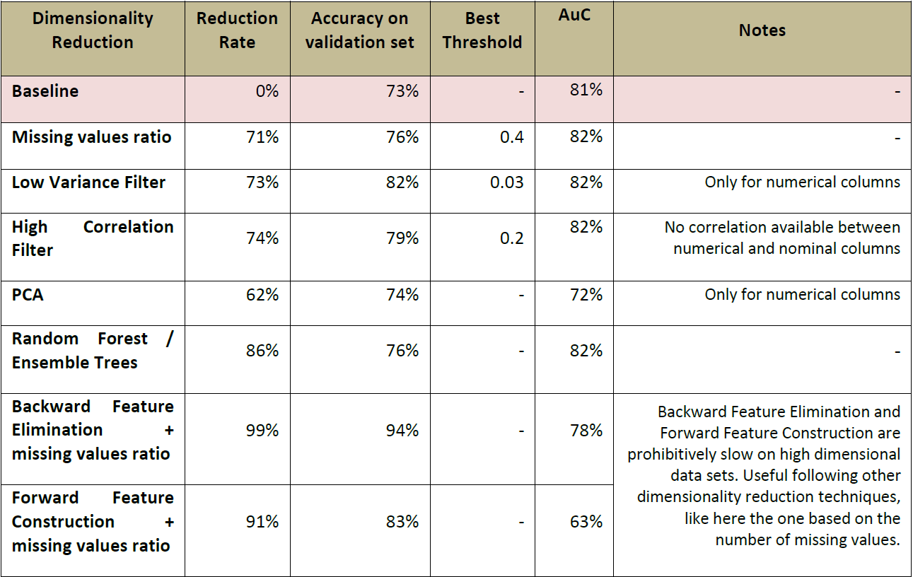
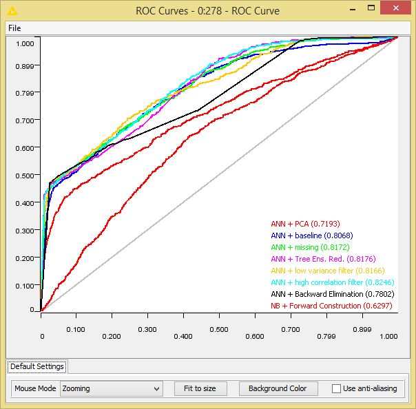

# 特征提取与特征选择是特征工程的两个主要内容
[参考](http://www.zhihu.com/question/28641663/answer/41653367)

**数据和特征决定了机器学习的上限, 而模型和算法只是逼近这个上限而已.**

通常而言，特征选择是指选择获得相应模型和算法最好性能的特征集，工程上常用的方法有以下：

1. **计算每一个特征与响应变量的相关性**. 工程上常用的手段有计算 *皮尔逊系数* 和 *互信息系数*, 皮尔逊系数只能衡量线性相关性而互信息系数能够很好地度量各种相关性, 但是计算相对复杂一些, 好在很多toolkit里边都包含了这个工具(如sklearn的MINE), 得到相关性之后就可以排序选择特征了;
2. **构建单个特征的模型**. 通过模型的准确性为特征排序, 借此来选择特征, 另外, 记得JMLR'03上有一篇论文介绍了一种基于决策树的特征选择方法, 本质上是等价的。当选择到了目标特征之后, 再用来训练最终的模型；
3. **通过L1正则项来选择特征**. L1正则方法具有稀疏解的特性, 因此天然具备特征选择的特性, 但是要注意, L1没有选到的特征不代表不重要, 原因是两个具有高相关性的特征可能只保留了一个, 如果要确定哪个特征重要应再通过L2正则方法交叉检验；
4. **训练能够对特征打分的预选模型**. RandomForest和Logistic Regression等都能对模型的特征打分, 通过打分获得相关性后再训练最终模型；
5. **通过特征组合后再来选择特征**. 如对用户id和用户特征最组合来获得较大的特征集再来选择特征, 这种做法在推荐系统和广告系统中比较常见, 这也是所谓亿级甚至十亿级特征的主要来源, 原因是用户数据比较稀疏, 组合特征能够同时兼顾全局模型和个性化模型, 这个问题有机会可以展开讲。
6. **通过深度学习来进行特征选择**. 目前这种手段正在随着深度学习的流行而成为一种手段, 尤其是在计算机视觉领域, 原因是深度学习具有自动学习特征的能力, 这也是深度学习又叫unsupervised feature learning的原因。从深度学习模型中选择某一神经层的特征后就可以用来进行最终目标模型的训练了。

# 特征的分类和评价指标
[参考](http://tech.meituan.com/machinelearning-data-feature-process.html?from=timeline&isappinstalled=0)

*进入模型的特征数据要建立起长期的监控体系.*

特征数据的获取难度，数据的规模，数据的准确率，数据的覆盖率等

* 数据获取难度
    + 例如获取用户id不难, 但是获取用户年龄和性别较困难, 因为用户注册或者购买时, 这些并不是必填项。即使填了也不完全准确。这些特征可能是通过额外的预测模型预测的, 那就存在着模型精度的问题
* 数据覆盖率
    + 数据覆盖率也是一个重要的考量因素, 例如距离特征, 并不是所有用户的距离我们都能获取到. PC端的就没有距离, 还有很多用户禁止使用它们的地理位置信息等.
    + 用户历史行为, 只有老用户才会有行为.
    + 用户实时行为, 如果用户刚打开app, 还没有任何行为, 同样面临着一个冷启动的问题.
* 数据的准确率

## 特征的分类
### Low vs High level 分法

*Low level* 特征是较低级别的特征, 主要是原始特征, 不需要或者需要非常少的人工处理和干预. Low level特征一般维度比较高, 不能用过于复杂的模型.

例如文本特征中的词向量特征, 图像特征中的像素点, 用户id, 商品id等.

*High level* 特征是经过较复杂的处理, 结合部分业务逻辑或者规则、模型得到的特征, 例如人工打分, 模型打分等特征, 可以用于较复杂的非线性模型. 

Low level 比较针对性, 覆盖面小. 长尾样本的预测值主要受high level特征影响.  高频样本的预测值主要受low level特征影响. 

### 稳定特征 vs 动态特征
*稳定特征* 是变化频率(更新频率)较少的特征, 例如评价平均分, 团购单价格等, 在较长的时间段内都不会发生变化. 

*动态特征* 是更新变化比较频繁的特征, 有些甚至是实时计算得到的特征, 例如距离特征, 2小时销量等特征. 或者叫做实时特征和非实时特征. 
针对两类特征的不同可以针对性地设计特征存储和更新方式, 例如对于稳定特征, 可以建入索引, 较长时间更新一次, 如果做缓存的话, 缓存的时间可以较长. 对于动态特征, 需要实时计算或者准实时地更新数据, 如果做缓存的话, 缓存过期时间需要设置的较短. 

### 二值特征、连续特征、枚举特征
*二值特征* 主要是0/1特征, 即特征只取两种值：0或者1, 例如用户id特征：目前的id是否是某个特定的id, 词向量特征：某个特定的词是否在文章中出现等等. 

*连续值特征* 是取值为有理数的特征, 特征取值个数不定, 例如距离特征, 特征取值为是0~正无穷. 

*枚举值特征* 主要是特征有固定个数个可能值, 例如今天周几, 只有7个可能值：周1, 周2, ..., 周日. 

在实际的使用中, 我们可能对不同类型的特征进行转换, 例如将枚举特征或者连续特征处理为二值特征. 枚举特征处理为二值特征技巧：将枚举特征映射为多个特征, 每个特征对应一个特定枚举值, 例如今天周几, 可以把它转换成7个二元特征：今天是否是周一, 今天是否是周二, ..., 今天是否是周日. 连续值处理为二值特征方法：先将连续值离散化（后面会介绍如何离散化), 再将离散化后的特征切分为N个二元特征, 每个特征代表是否在这个区间内. 

## 特征归一化，离散化，缺省值处理
主要用于单个特征的处理。

### 归一化
不同的特征有不同的取值范围, 在有些算法中, 例如线性模型或者距离相关的模型像聚类模型、knn模型等, 特征的取值范围会对最终的结果产生较大影响, 例如二元特征的取值范围为[0, 1], 而距离特征取值可能是[0, 正无穷), 在实际使用中会对距离进行截断, 例如[0, 3000000], 但是这两个特征由于取值范围不一致导致了模型可能会更偏向于取值范围较大的特征, 为了平衡取值范围不一致的特征, 需要对特征进行归一化处理, 将特征取值归一化到［0, 1］区间. 常用的归一化方法包括1.函数归一化, 通过映射函数将特征取值映射到［0, 1］区间, 例如最大最小值归一化方法, 是一种线性的映射. 还有通过非线性函数的映射, 例如log函数等. 2.分维度归一化, 可以使用最大最小归一化方法, 但是最大最小值选取的是所属类别的最大最小值, 即使用的是局部最大最小值, 不是全局的最大最小值. 3.排序归一化, 不管原来的特征取值是什么样的, 将特征按大小排序, 根据特征所对应的序给予一个新的值. 

### 离散化
在上面介绍过连续值的取值空间可能是无穷的, 为了便于表示和在模型中处理, 需要对连续值特征进行离散化处理. 常用的离散化方法包括等值划分和等量划分. 等值划分是将特征按照值域进行均分, 每一段内的取值等同处理. 例如某个特征的取值范围为[0, 10], 我们可以将其划分为10段, [0, 1), [1, 2), ..., [9, 10). 等量划分是根据样本总数进行均分, 每段等量个样本划分为1段. 例如距离特征, 取值范围［0, 3000000］, 现在需要切分成10段, 如果按照等比例划分的话, 会发现绝大部分样本都在第1段中. 使用等量划分就会避免这种问题, 最终可能的切分是[0, 100), [100, 300), [300, 500), .., [10000, 3000000], 前面的区间划分比较密, 后面的比较稀疏. 

### 缺省值处理
有些特征可能因为无法采样或者没有观测值而缺失, 例如距离特征, 用户可能禁止获取地理位置或者获取地理位置失败, 此时需要对这些特征做特殊的处理, 赋予一个缺省值. 缺省值如何赋予, 也有很多种方法. 例如单独表示, 众数, 平均值等. 

## 特征降维
在机器学习中, 有一个VC维理论. 根据VC维理论, VC维越高, 打散能力越强, 可容许的模型复杂度越高. 在低维不可分的数据, 映射到高维是可分. 可以想想, 给你一堆物品, 人脑是如何对这些物品进行分类, 依然是找出这些物品的一些特征, 例如：颜色, 形状, 大小, 触感等等, 然后根据这些特征对物品做以归类, 这其实就是一个先升维, 后划分的过程. 比如我们人脑识别香蕉. 可能首先我们发现香蕉是黄色的. 这是在颜色这个维度的一个切分. 但是很多东西都是黄色的啊, 例如哈密瓜. 那么怎么区分香蕉和哈密瓜呢？我们发现香蕉形状是弯曲的. 而哈密瓜是圆形的, 那么我们就可以用形状来把香蕉和哈密瓜划分开了, 即引入一个新维度：形状, 来区分. 这就是一个从“颜色”一维特征升维到二维特征的例子. 

那问题来了, 既然升维后模型能力能变强, 那么是不是特征维度越高越好呢？为什么要进行特征降维&特征选择？主要是出于如下考虑：

1. 特征维数越高, 模型越容易过拟合, 此时更复杂的模型就不好用. 
2. 相互独立的特征维数越高, 在模型不变的情况下, 在测试集上达到相同的效果表现所需要的训练样本的数目就越大.  
3. 特征数量增加带来的训练、测试以及存储的开销都会增大. 
4. 在某些模型中, 例如基于距离计算的模型KMeans, KNN等模型, 在进行距离计算时, 维度过高会影响精度和性能. 
5. 可视化分析的需要. 在低维的情况下, 例如二维, 三维, 我们可以把数据绘制出来, 可视化地看到数据. 当维度增高时, 就难以绘制出来了. 
在机器学习中, 有一个非常经典的维度灾难的概念. 用来描述当空间维度增加时, 分析和组织高维空间, 因体积指数增加而遇到各种问题场景. 例如, 100个平均分布的点能把一个单位区间以每个点距离不超过0.01采样；而当维度增加到10后, 如果以相邻点距离不超过0.01小方格采样单位超一单位超正方体, 则需要10^20 个采样点. 

正是由于高维特征有如上描述的各种各样的问题, 所以我们需要进行特征降维和特征选择等工作. 特征降维常用的算法有PCA, LDA等. 特征降维的目标是将高维空间中的数据集映射到低维空间数据, 同时尽可能少地丢失信息, 或者降维后的数据点尽可能地容易被区分

## 特征选择-产生过程和生成特征子集方法
* 完全搜索(Complete)
    + 广度优先搜索( Breadth First Search )
    + 广度优先遍历特征子空间. 枚举所有组合, 穷举搜索, 实用性不高. 
    + 分支限界搜索( Branch and Bound )
        穷举基础上加入分支限界. 例如：剪掉某些不可能搜索出比当前最优解更优的分支. 
    + 其他, 如定向搜索 (Beam Search ), 最优优先搜索 ( Best First Search )等

* 启发式搜索(Heuristic)
    + 序列前向选择( SFS ,  Sequential Forward Selection )
        从空集开始, 每次加入一个选最优. 
    + 序列后向选择( SBS ,  Sequential Backward Selection )
        从全集开始, 每次减少一个选最优. 
    + 增L去R选择算法 ( LRS ,  Plus-L Minus-R Selection )
        从空集开始, 每次加入L个, 减去R个, 选最优（L>R)或者从全集开始, 每次减去R个, 增加L个, 选最优(L<R). 

其他如双向搜索( BDS ,  Bidirectional Search ), 序列浮动选择( Sequential Floating Selection )等

* 随机搜索(Random)
    + 随机产生序列选择算法(RGSS,  Random Generation plus Sequential Selection)
        随机产生一个特征子集, 然后在该子集上执行SFS与SBS算法. 
    + 模拟退火算法( SA,  Simulated Annealing )
        以一定的概率来接受一个比当前解要差的解, 而且这个概率随着时间推移逐渐降低
    + 遗传算法( GA,  Genetic Algorithms )
        通过交叉、突变等操作繁殖出下一代特征子集, 并且评分越高的特征子集被选中参加繁殖的概率越高. 
随机算法共同缺点:依赖随机因素, 有实验结果难重现. 

# 特征降维的七种方法
[参考](http://bi.dataguru.cn/article-8215-1.html)

## 缺失值比率 (Missing Values Ratio)
该方法的是基于包含太多缺失值的数据列包含有用信息的可能性较少. 因此, 可以将数据列缺失值大于某个阈值的列去掉. 阈值越高, 降维方法更为积极, 即降维越少. 

## 低方差滤波 (Low Variance Filter)
与上个方法相似, 该方法假设数据列变化非常小的列包含的信息量少. 因此, 所有的数据列方差小的列被移除. 需要注意的一点是：方差与数据范围相关的, 因此在采用该方法前需要对数据做归一化处理. 

## 高相关滤波 (High Correlation Filter)
高相关滤波认为当两列数据变化趋势相似时, 它们包含的信息也显示. 这样, 使用相似列中的一列就可以满足机器学习模型. 对于数值列之间的相似性通过计算相关系数来表示, 对于名词类列的相关系数可以通过计算皮尔逊卡方值来表示. 相关系数大于某个阈值的两列只保留一列. 同样要注意的是：相关系数对范围敏感, 所以在计算之前也需要对数据进行归一化处理. 

## 随机森林/组合树 (Random Forests)
组合决策树通常又被成为随机森林, 它在进行特征选择与构建有效的分类器时非常有用. 一种常用的降维方法是对目标属性产生许多巨大的树, 然后根据对每个属性的统计结果找到信息量最大的特征子集. 例如, 我们能够对一个非常巨大的数据集生成非常层次非常浅的树, 每颗树只训练一小部分属性. 如果一个属性经常成为最佳分裂属性, 那么它很有可能是需要保留的信息特征. 对随机森林数据属性的统计评分会向我们揭示与其它属性相比, 哪个属性才是预测能力最好的属性. 

## 主成分分析 (PCA)
主成分分析是一个统计过程, 该过程通过正交变换将原始的 n 维数据集变换到一个新的被称做主成分的数据集中. 变换后的结果中, 第一个主成分具有最大的方差值, 每个后续的成分在与前述主成分正交条件限制下与具有最大方差. 降维时仅保存前 m(m < n) 个主成分即可保持最大的数据信息量. 需要注意的是主成分变换对正交向量的尺度敏感. 数据在变换前需要进行归一化处理. 同样也需要注意的是, 新的主成分并不是由实际系统产生的, 因此在进行 PCA 变换后会丧失数据的解释性. 如果说, 数据的解释能力对你的分析来说很重要, 那么 PCA 对你来说可能就不适用了. 

## 反向特征消除 (Backward Feature Elimination)
在该方法中, 所有分类算法先用 n 个特征进行训练. 每次降维操作, 采用 n-1 个特征对分类器训练 n 次, 得到新的 n 个分类器. 将新分类器中错分率变化最小的分类器所用的 n-1 维特征作为降维后的特征集. 不断的对该过程进行迭代, 即可得到降维后的结果. 第k 次迭代过程中得到的是 n-k 维特征分类器. 通过选择最大的错误容忍率, 我们可以得到在选择分类器上达到指定分类性能最小需要多少个特征. 

## 前向特征构造 (Forward Feature Construction)
前向特征构建是反向特征消除的反过程. 在前向特征过程中, 我们从 1 个特征开始, 每次训练添加一个让分类器性能提升最大的特征. 前向特征构造和反向特征消除都十分耗时. 它们通常用于输入维数已经相对较低的数据集. 

## 总结
我们选择 2009 KDD chanllenge 的削数据集来对这些降维技术在降维率、准确度损失率以及计算速度方面进行比较. 当然, 最后的准确度与损失率也与选择的数据分析模型有关. 因此, 最后的降维率与准确度的比较是在三种模型中进行, 这三种模型分别是：决策树, 神经网络与朴素贝叶斯. 

通过运行优化循环, 最佳循环终止意味着低纬度与高准确率取决于七大降维方法与最佳分类模型. 最后的最佳模型的性能通过采用所有特征进行训练模型的基准准确度与 ROC 曲线下的面积来进行比较. 下面是对所有比较结果的对比. 

从上表中的对比可知, 数据降维算法不仅仅是能够提高算法执行的速度, 同时也能过提高分析模型的性能.  在对数据集采用：缺失值降维、低方差滤波, 高相关滤波或者随机森林降维时, 表中的 AoC 在测试数据集上有小幅度的增长. 

确实在大数据时代, 数据越多越好似乎已经成为公理. 我们再次解释了当数据数据集宝航过多的数据噪声时, 算法的性能会导致算法的性能达不到预期. 移除信息量较少甚至无效信息唯独可能会帮助我们构建更具扩展性、通用性的数据模型. 该数据模型在新数据集上的表现可能会更好. 

最近, 我们咨询了 LinkedIn 的一个数据分析小组在数据分析中最为常用的数据降维方法, 除了本博客中提到的其中, 还包括：随机投影(Random Projections)、非负矩阵分解(N0n-negative Matrix Factorization),自动编码(Auto-encoders),卡方检测与信息增益(Chi-square and information gain),  多维标定(Multidimensional Scaling), 相关性分析(Coorespondence Analysis), 因子分析(Factor Analysis)、聚类(Clustering)以及贝叶斯模型(Bayesian Models). 

